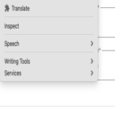

# Translate to Turkish – Chrome Extension

**Translate to Turkish** is a lightweight, privacy-respecting Chrome extension that allows you to instantly translate selected English text to Turkish using Google Translate — all from your browser's right-click context menu.

---

## 🧠 Features

- ✅ Right-click any selected English text to translate
- 🌐 Instantly opens the translated result in Google Translate
- 🔒 No tracking, no data collection, 100% private
- 🧩 Built with Chrome Manifest V3 for performance and security

---

## 📦 Installation

### ➤ From Source
1. [Download the ZIP](https://github.com/themanoftalent/translate-to-turkish-extension/archive/refs/heads/main.zip)
2. Unzip it
3. Go to `chrome://extensions`
4. Enable **Developer Mode**
5. Click **Load Unpacked** and select the folder

---

## 🧩 Usage

1. Highlight any English sentence or word on a webpage
2. Right-click → Select **"Translate to Turkish"**
3. A new tab will open with the Turkish translation in Google Translate

---

## 🔐 Privacy Policy

This extension does **not** collect, store, or transmit any personal data. All actions are:
- Fully local
- User-triggered
- Sent only to Google Translate with no intermediate processing

> 📄 [View Full Privacy Policy](privacy.md)

---

## 💬 Support & Contact

For questions or suggestions, please contact:
- GitHub: [@themanoftalent](https://github.com/themanoftalent)
- Email: [yourname@example.com](mailto:yourname@example.com)

---

## 📃 License

This extension is released under the [MIT License](LICENSE). Feel free to fork, modify, and improve!

---

> Developed with ♥ by [@themanoftalent](https://github.com/themanoftalent)
